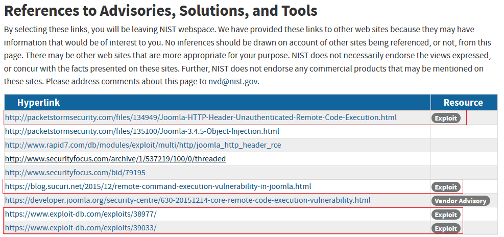

# How to Implement PoCs?
## Principle
For network security, the fundamental **GOAL** of reproducing PoC is to **generate network traffic**!!! Do whatever you can, to reproduce network traffic. 

## Full Reproduction of a PoC
1. Try to install the vulnerable software,  Execute the PoC
2. Check whether there is a **Docker Image** or not. If so, install the **Docker Image**

## Partial Reproduction of a PoC (Simulate attacker side only)
1. If installing the vulnerable software or setting up the environment is too difficult,
 
   Try to **Setup a FAKE server** instead.  Then Execute the PoC. (CVE-2020-5398)
 
2. If executing the PoC fail or too difficult:   

(1) **Extract attack payload** from the PoC. Use tools (Curl, Postman, httpie) to create the attack payload. Then Deliver it to attack the FAKE Server.   (CVE-2020-5398)    

(2) Find the **attack payload** online, and BUILD the attack request with tools (Curl, Postman, httpie). DELIVER it to the FAKE Server 
 
(3) Try to understand the PoC, Adjust the arguments of running PoC.  (CVE-2020-8592)   
 
(4) Try to understand the PoC, **MAKE CHANGES** to the PoC code.  (CVE-2021-32648)                      
    a. Delete or comment some code
  
(5) Try to undestand the PoC.  **Extract attack payload** from the SCRIPT of the PoC. Use tools (Curl, Postman, httpie) to create the attack payload. Then DELIVER it to attack the FAKE Server.

 	
## Public PoCs
(1) **Exploit** Link in NVD   \
(2) Search "CVE-XXXX-YYY PoC" in Google
(3) Github, ExploitDB, Researcher blogs, Security Team website, Twitter, etc

	                     

## Practice
CVE-2020-5398     \
CVE-2015-8562     \
CVE-2021-32648    \
CVE-2022-27926    \ 
CVE-2022-4395     \
CVE-2021-31755    \
CVE-2023-39358    \
CVE-2021-31762    \
CVE-2021-31761    \
CVE-2021-42392

