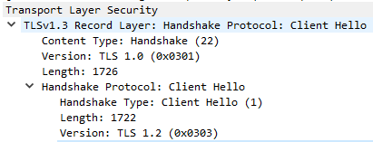
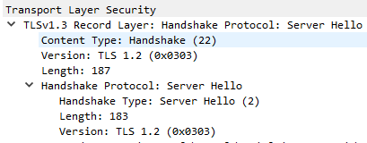
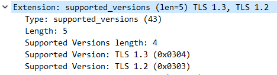

# TLS
 ## TLS versions in Handshake
1. **Client_hello** \
  
  
  (1) **TLS Record Layer Version (TLS 1.0)** \
This version specifies the highest version of the protocol that both parties (client and server) understand for backward compatibility. Many clients set the version field in the record layer to an older version like TLS 1.0 or even SSL 3.0 to ensure compatibility with a wide range of servers. This does not necessarily mean that the communication will use TLS 1.0; it’s just a conservative choice to avoid any initial rejection by older servers.

  (2) **TLS Handshake Protocol Version (TLS 1.2)** \
This version is specified in the actual "Client Hello" message and indicates the highest version of the TLS protocol that the client supports and wants to use for this session.
	
2. **Server_hello** \
 

(1) **TLS Record Layer Version (TLS 1.0)** \
This version in the TLS Record Layer header specifies the version of the protocol used to encapsulate and transmit the handshake messages. It often represents the maximum version that the server and client have agreed upon.

(2) **TLS Handshake Protocol Version (TLS 1.2)** \
This version specified inside the "Server Hello" message confirms the version of the protocol that the server has chosen for the session. It indicates that both the server and client will use TLS 1.2 for the secure communication session.

3. **Extension: Supported_versions** \
 

Note: 
This seems to suggest that the client is requesting a TLS 1.2 handshake. In fact, it is — If the server only understands TLS 1.2, it will just negotiate a TLS 1.2 handshake as before. 
But if that's the case, how does the client advertise to the server that it actually does understand TLS 1.3? Well, the answer is "Extension: Supported_versions".  The Supported_versions notifies the server that the highest version the client is willing to support, but the server is free to negotiate any prior version.

##TLS 1.3##
In TLS 1.3, everything after the server hello is now encrypted, including the certificate exchange
