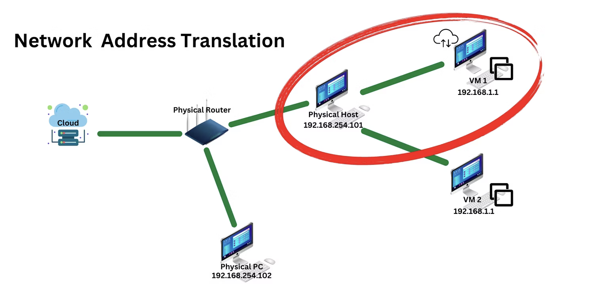
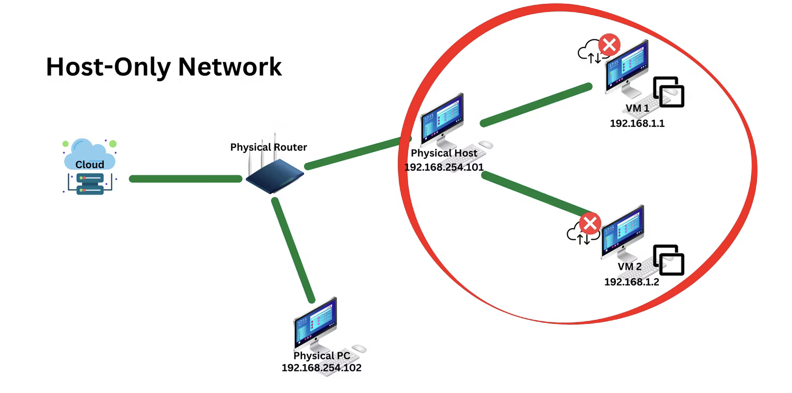
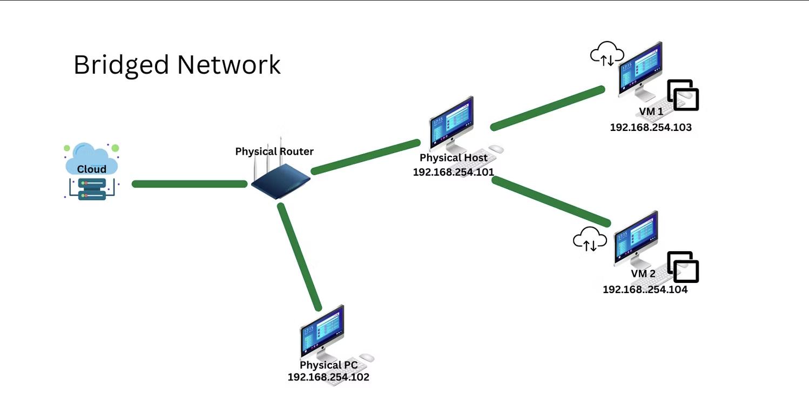

# Virtual Network Modes

## NAT Network

Network Address Translation (NAT) is a networking mode where the hosts translate the VM's IP address to the router for the VM can connect to the internet.

Basically, when connecting to the internet, the VM's IP address gets masked by the host's IP address. This mode does not allow the interconnection between VMs, nor does it allow a VM to communicate with other physical machines except the host. 

The VM is given an IP address through a virtual DHCP server linked to the physical host's network modem, not the DHCP server from the physical router. A virtual DHCP server is automatically created whenever a virtual machine is made. 

## Host-only Network

A host-only network allows all VMs and the host machine to network with each other while being cut off from the physical network. And since the host machine doesn't translate the address for the VMs, the router cannot provide them with any internet access. 

A host-only network provides the highest level of network security in exchange for very limited networking capabilities.

A host-only network uses a virtual DHCP server from the host machine to give a unique IP address to each VM. MAC addresses are automatically set, but you can change the MAC address and IP address if you want to. 

## Bridged Network

A bridged network allows a VM to network with other VMs and all physical machines on the physical network. Although a bridged network provides VMs with all the networking functionalities, it also significantly decreases its security as the VMs are also susceptible to networking vulnerabilities, similar to an open physical network. 

A bridged network is the most permissive of all network connection types.

## Reference:
https://www.makeuseof.com/whats-the-difference-nat-bridge-host-only-network-modes/
